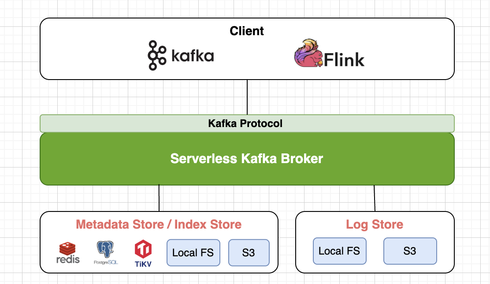

# Stateless Kafka Broker

A minimal, Stateless Kafka broker implementation in Rust.

## 🚀 Overview

`stateless-kafka-broker` is an experimental Kafka-compatible broker built with the following design goals:

- Stateless (no internal storage or metadata persistence)
- Lightweight and easy to deploy
- Implements essential Kafka protocol handling (e.g., `ProduceRequest`, `FetchRequest`, etc.)
- Designed for use in ephemeral or serverless environments

This project is ideal for exploring how Kafka protocol works, building custom broker-side logic, or embedding minimal Kafka functionality in controlled environments.

## ✨ Features

- **Stateless by design**: No Zookeeper or KRaft dependency. All metadata and log data are delegated to pluggable backends.
- **Pluggable storage backends**: Choose from file system, Redis, S3, or other custom implementations for Meta Store, Log Store, and Index Store.
- **Lightweight and portable**: Minimal binary size, easy to deploy in serverless or ephemeral environments.
- **Protocol compatibility**: Implements essential Kafka protocol handling (e.g., `ProduceRequest`, `FetchRequest`, etc.).
- **Fully asynchronous**: Written in pure async Rust using `tokio` for high concurrency and performance.
- **Flexible scaling**: Stateless design enables horizontal scaling without complex state coordination.
- **Customizable broker logic**: Designed for experimentation and extending Kafka protocol behavior.

## 📦 Usage

```bash
# Clone the repo
git clone https://github.com/m-masataka/stateless-kafka-broker
cd stateless-kafka-broker

# Run the broker
cargo run
```
By default, it listens on port 9092 and handles a subset of Kafka protocol requests.

⚠️ Note: This broker is not suitable for production use. It is designed for learning, testing, and minimal simulation purposes.

### S3 backend
set key/secret

```
export AWS_ACCESS_KEY_ID=AKIAxxxxxxxxxxxxxxxx
export AWS_SECRET_ACCESS_KEY=xxxxxxxxxxxxxxxxxxxxxxx
export AWS_REGION=ap-northeast-1
```

## 🧩 Architecture

The core idea behind `stateless-kafka-broker` is to provide a lightweight, pluggable Kafka-compatible broker, where state persistence and log storage are **externalized and modularized**.

This diagram illustrates the overall architecture of the **stateless-kafka-broker** project. Clients such as Kafka and Flink connect to the **Serverless Kafka Broker** using the standard Kafka protocol. The broker itself does not maintain any internal state; instead, all metadata and log data are delegated to external storage systems.



### Pluggable Storage Design

The broker is composed of three main components, each of which supports **pluggable** storage backends:

- **Metadata Store / Index Store**  
  Stores topic metadata and index information.  
  Available backend options: Redis, PostgreSQL, TiKV, Local FS, S3, and more.

- **Log Store**  
  Stores actual message logs.  
  Available backend options: Local FS, S3, and more.

This design provides the flexibility to select the most suitable storage backend depending on your workload and operational requirements. For example, you can use Redis for fast metadata access while persisting logs to S3 for cost-efficient durability, or use only a local filesystem for simpler deployments.

### Flexible Scalability and Cost Optimization

- A completely **stateless** design enables easy scale-out and scale-in.
- You can swap storage backends to optimize performance and cost.
- Hybrid configurations combining cloud and on-premise storage are also possible.

---

Feel free to adjust the backend combinations to best fit your architecture and operational needs!

**Backends (planned/pluggable):**
- Local file storage
- Amazon S3 / GCS (object storage)
- Redis TiKV

---

## 🧱 Modularity Goals

- No hard-coded state logic: everything is injectable
- Component abstraction traits: `MetaStore`, `LogStore`, `IndexStore`
- Easy to mock and test
- Serverless/federated deployment ready

---

## 📌 Example Use Cases

| Environment        | Meta Store   | Log Store  | Index Store |
|--------------------|--------------|------------|-------------|
| Local dev          | File         | File       | File        |
| Cloud Native App   | Redis        | S3         | TiKV        |
| Simple(performance is not Critical)          | S3           | S3         | S3          |

